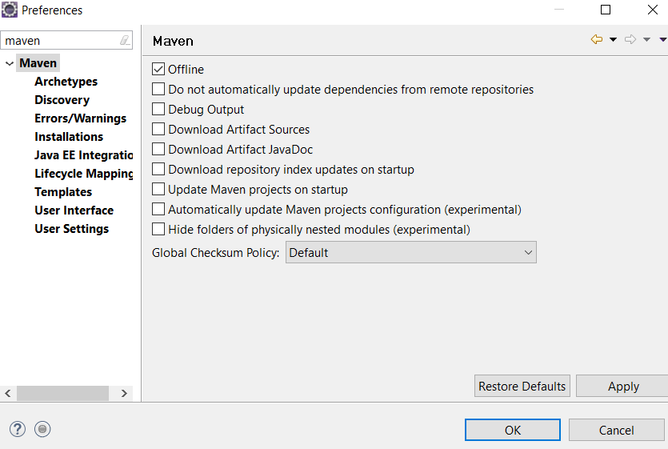
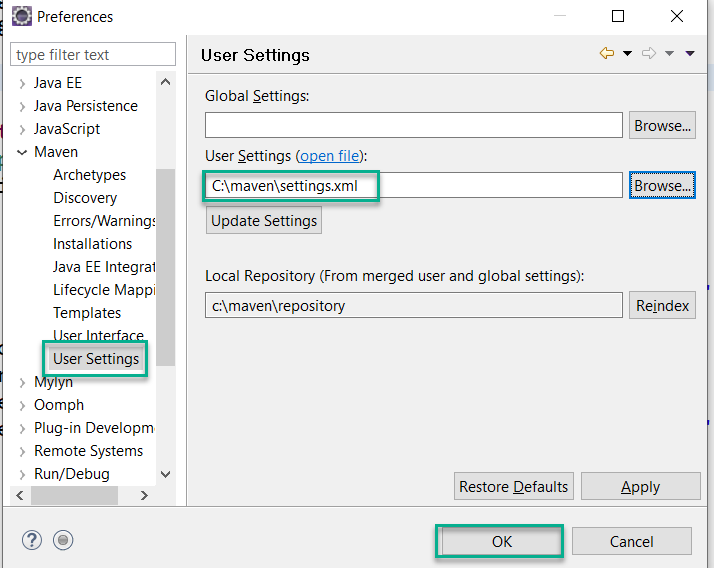

## Spring Core & Spring Boot

This repository contains demos from my May-2019 batch.

### Steps to setup maven repository

1.  Download file [repository.zip](repositor.zip)
2.  Create a folder on your C: drive with name **maven**
3.  Extract contents of _repository.zip_ into C:\maven directory
4.  Open C:\Maven directory with file explorer, and verify that you have one "settings.xml" file along with "repository" folder.
5.  Open your **Spring ToolSuite** with new Workspace and then goto _Window_ -> _Preferences_ -> Search for "Maven"

6.  Make sure you select "Offline" and clear ALL other options. Just like screenshot attached below:

    

7.   Now, Goto "User Settings" from left side section and change the location of maven settings file.

        

8.  Press OK, Now Start creating Spring Boot projects!

    NOTE: Spring framework version included in this offline repository are:
        
        1.  Spring-Core 5.1.6
        2.  Spring-Boot 2.1.4
        3.  Hibernate-core 5.3.9
        4.  Oracle JDBC Driver 6.0
