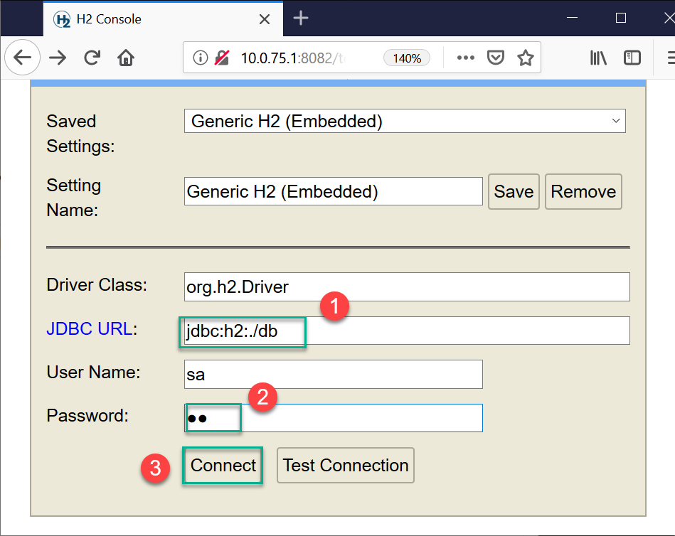
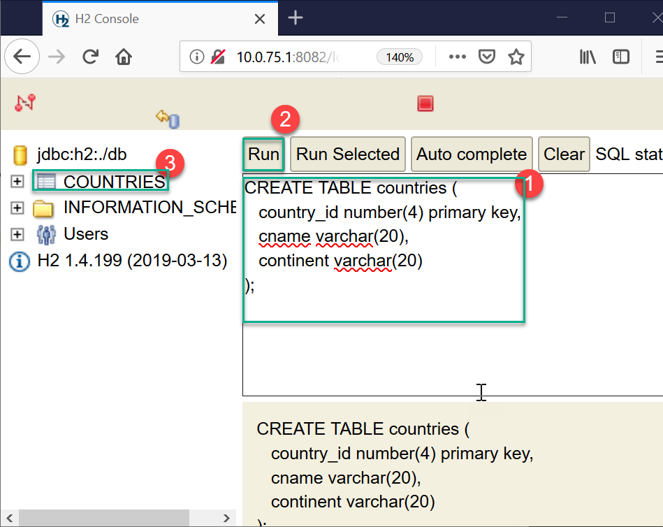

# RDBMS for Dev Enviornment _h2database_

h2database is lightweight In-Memory database used for Dev/Test enviornments. This database is NOT for production environment.

Benefits:
    
    1. No Installation !
    2. Lightweight ( ~2MB in size)
    3. Pure RDBMS (SQL Supported)
    4. Can run as In-Memory/Embedded/Server mode

## How to Get H2Database?

- Visit https://mvnrepository.com and search for h2database.
- Choose "h2 database engine", select top most version.
- Click on version number (1.4.199) and then click "jar(2.1 mb)"
- Once downloaded, copy JAR file to folder: `C:\h2database`
- Open Command prompt and write following commands:

    ```bash
    cd C:\h2database
    java -jar h2-1.4.199.jar

    ```
- Once you get browser with h2database web console open, add following connection settings:

    ```ini
    Driver-Class=    org.h2.Driver
    JDBC-URL=        jdbc:h2:./db
    Username=        sa
    Password=        sa
    ```

- Hit "Connect" button to start Database connection.

    

- Write SQL Queries (Table creation and record creation queries)

    

    ```sql
    create table countries
    (
        country_id number(4) primary key,
        cname varchar(20),
        continent varchar(20)
    );

    INSERT into COUNTRIES
    values(101, 'India', ' Asia');
    
    INSERT into COUNTRIES
    values(102, 'Wakanda', 'Africa');
    ```
- In Spring boot (using data-jpa) project following changes are required:
    
    1. In `pom.xml` file replace dependency for oracle jdbc driver with h2database

    Old dependency:
    ```xml
    <dependency>
  		<groupId>com.oracle</groupId>
  		<artifactId>ojdbc6</artifactId>
  		<version>11.2.0.3</version>
  	</dependency>
    ```

    With New one:
    ```xml
    <dependency>
        <groupId>com.h2database</groupId>
        <artifactId>h2</artifactId>
        <version>1.4.199</version>
        <scope>test</scope>
    </dependency>
    ```

    Modify `application.properties` file
    ```ini
    replace old lines:
    #Provide DataSource properties (for JDBC Connection)
    spring.datasource.username=hr
    spring.datasource.password=hr
    spring.datasource.url=jdbc:oracle:thin:@localhost:1521/xe
    spring.datasource.driver-class-name=oracle.jdbc.OracleDriver

    #Overriding default JPA settings
    spring.jpa.show-sql=true
    spring.jpa.database-platform=org.hibernate.dialect.Oracle10gDialect
    ```
    
    with these ones:
    ```ini
    #Provide DataSource properties (for JDBC Connection)
    spring.datasource.username=sa
    spring.datasource.password=sa
    spring.datasource.url=jdbc:h2:c:\h2database\db
    spring.datasource.driver-class-name=org.h2.Driver

    #Overriding default JPA settings
    spring.jpa.show-sql=true
    spring.jpa.database-platform=org.hibernate.dialect.H2Dialect
    ```

