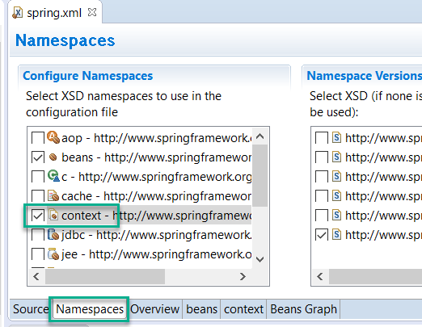

## How to Use Property Placeholder 

Create a copy of "AutowiringDemo" for implementing Property Placeholder

1. create new File with name "myprops.properties"
   in "src" folder.
   
   NOTE: In case of Maven project, file should be
	 inside "src/main/resouces" folder

2. Add few properties like :
   
        fname=Dakshata
        lname=Shinde

3. Open "spring.xml" file, using "namespaces" tab, add "context" namespaces.

	

4. Switch to "source" view of "spring.xml" file and add this line:

	```xml
    <context:property-placeholder location="classpath:/myprops.properties" />
	```

5. Modify "employee" bean like this:

	```xml
	<bean id="emp" class="com.cg.models.Employee" autowire="byName">
	        <property name="firstName" value="${fname}" />
	        <property name="lastName" value="${lname}"/>
	</bean>
	```

NOTE: the values written with syntax ${KEY} is called "Spring Expression"
	and usually referred as SpEL (Short for Spring Expression Language)
	And this one internally uses Post Processors!
