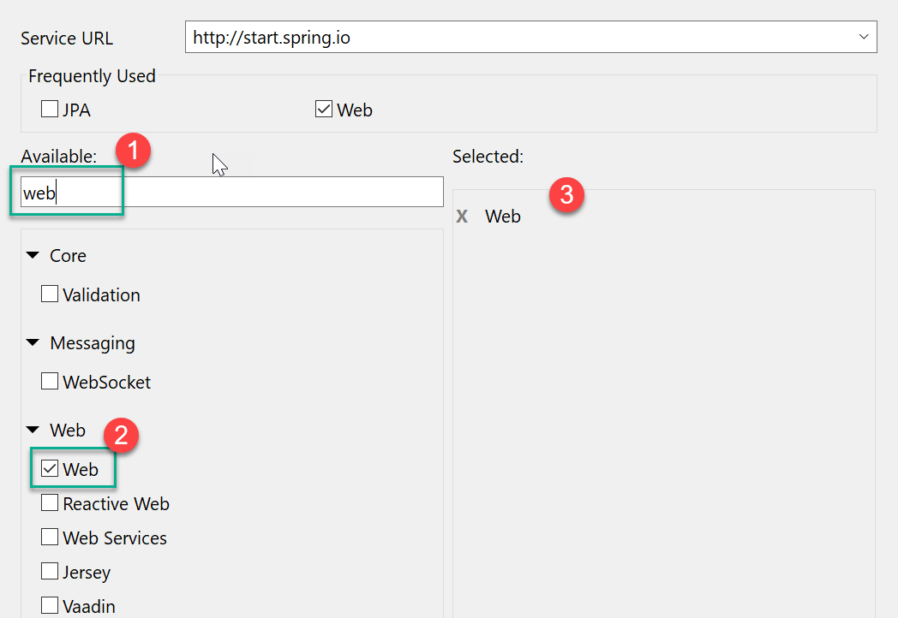
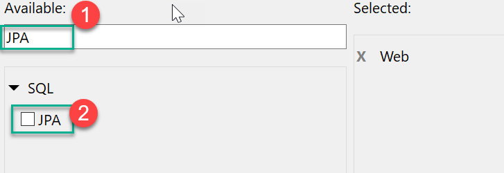
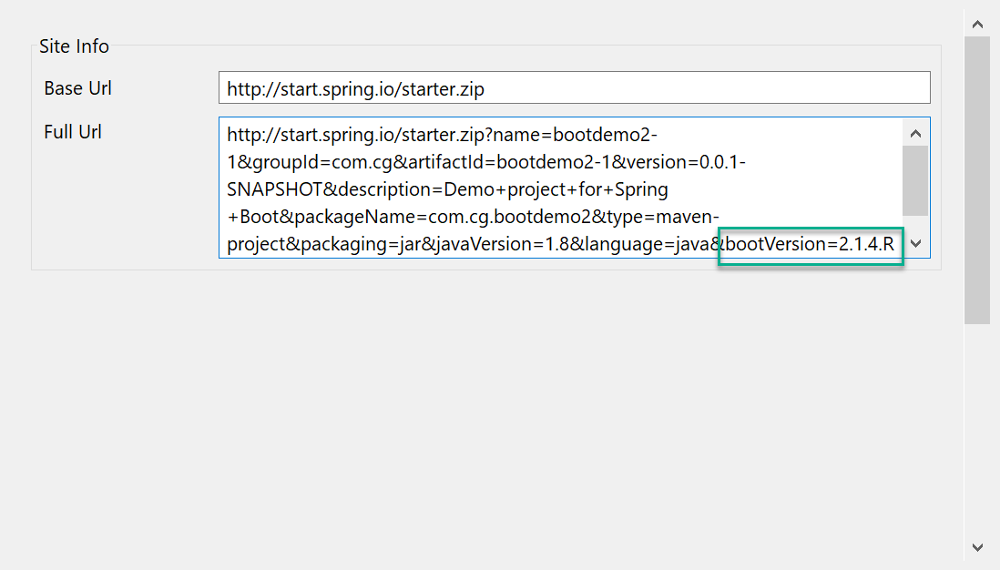

## Creating new Spring DATA-JPA project using Spring boot

1.  New -> Spring Starter project

    ```yaml
    name: 		bootdemo2
    group:		com.cg
    artifact:	bootdemo2
    package:    com.cg.bootdemo2
    ```

    > Click Next

2.  add "web" and "jpa"
    
    
    
    

    > Click next

3.  change bootVersion to 2.1.4.RELEASE

     
     
4.  Click "Finish"

5.  Open ```src/main/resources/application.properties``` file and add following properties:

    ```ini
    # Overwrite default port (from 8080 to 5000)
    server.port=5000

    #Provide DataSource properties (for JDBC Connection)
    spring.datasource.username=hr
    spring.datasource.password=hr
    spring.datasource.url=jdbc:oracle:thin:@localhost:1521/xe
    spring.datasource.driver-class-name=oracle.jdbc.OracleDriver

    #Overriding default JPA settings
    spring.jpa.show-sql=true
    spring.jpa.database-platform=org.hibernate.dialect.Oracle10gDialect

    # Enable JPA Repositories (Default: true)
    spring.data.jpa.repositories.enabled=true
    ```

6.  Open pom.xml file and add new dependency for Oracle JDBC driver

    ```xml
    <dependency>
		<groupId>com.oracle</groupId>
		<artifactId>ojdbc6</artifactId>
		<version>11.2.0.3</version>
	</dependency>
    ```

7.  Create a new Entity class 

    ```yaml
    Classname:  Movie
    Package:    com.cg.bootdemo2.entities
    ```

    ```java
    @Entity @Table(name="movies")
    public class Movie {
	
	@Id private Integer id;
	
	@Column(length=40)
	private String title;
	
	@Column(length=40)
	private String director;
	
	private Double budget;
	
	@Column(length=10)
    private String genre;
    //add getters and setters
    }
    ```
    > The complete Movie.java could be found [here](bootdemo2/src/main/java/com/cg/bootdemo2/entities/Movie.java)

8.  Create new DAO Interface 

    ```yaml
    Interface name: MovieDAO
    Package:        com.cg.bootdemo2.dao
    ```

    ```java
    @Repository
    public interface MovieDAO
        extends JpaRepository<Movie, Integer>{

    }
    ```

    > The complete MovieDAO interface could be found [here](bootdemo2/src/main/java/com/cg/bootdemo2/dao/MovieDAO.java)

9.  Create new Service Interface

    ```yaml
    Interface name: MovieService
    Package name:   com.cg.bootdemo2.services
    ```

    ```java
    public interface MovieService {

	    void save(Movie m);
	    Movie findById(Integer id);
    }
    ```

    > The complete MovieService interface could be found [here](bootdemo2/src/main/java/com/cg/bootdemo2/services/MovieService.java)

10. Create new Service Implementation class

    ```yaml
    Classname:  MovieServiceImpl
    Package:    com.cg.bootdemo2.services
    ```

    ```java
    @Service // Special annotation for Services
    @Transactional // Enable Declarative transaction support 
    public class MovieServiceImpl implements MovieService {

        @Autowired private MovieDAO dao;
        
        @Transactional
        public void save(Movie m) {
            dao.save(m);
        }

        @Transactional(readOnly=true)
        public Movie findById(Integer id) {
            // TODO Auto-generated method stub
            return dao.findById(id).get();
        }

    }
    ```
    > The complete MovieServiceImpl class could be found [here](bootdemo2/src/main/java/com/cg/bootdemo2/services/MovieServiceImpl.java)

11. Create a new controller 

    ```yaml
    Classname:  MovieController
    Package:    com.cg.bootdemo2.controllers
    ```

    ```java
    @RestController
    public class MovieController {

        @Autowired private MovieService service;
        
        // http://localhost:5000/find?id=10023
        @GetMapping("/find")
        public Movie find(@RequestParam("id") Integer id) {
            System.out.println("Search for movie by id "+id);
            Movie m = service.findById(id);
            return m;
        }
    }
    ```

    > The complete MovieController class could be found [here](bootdemo2/src/main/java/com/cg/bootdemo2/controllers/MovieController.java)

12. Run Project as "Spring Boot Application" and then hit URL:
    http://localhost:5000/find?id=10023

    > NOTE: Make sure movie with ID 10023 is present in database.