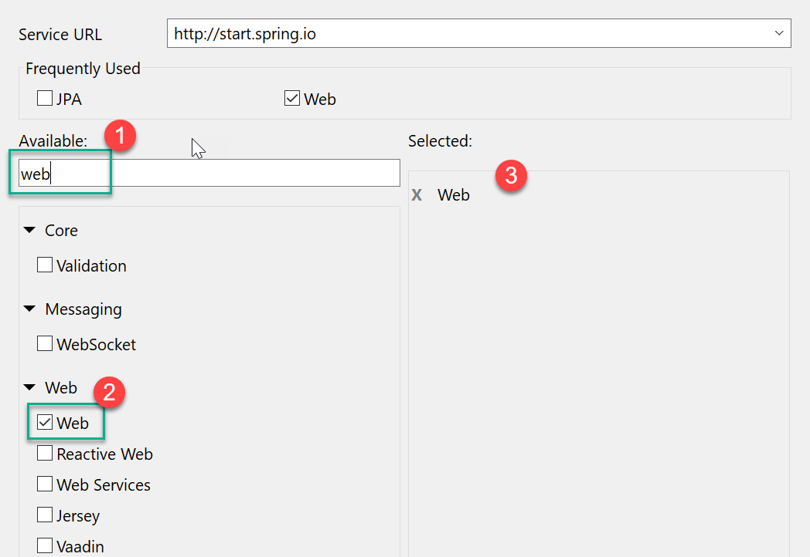

## Creating simple REST Service with @PathVariable and @RequestParam

1. Create new Spring Boot Application
    
    * New -> Spring Starter Project
    * Enter project details:
        ```yaml
        Name:       rest-param-demo
        GroupId:    com.cg
        Artifact:   restparamdemo
        Packaging:  jar
        package:    com.cg.restparamdemo
        ```
    * Click NEXT, and Select "web" from list of dependencies.
    
    * Click NEXT, change spring boot version to 2.1.4

    

2.  Create new Rest Controller class:

    ```yaml
    Package:    com.cg.restparamdemo.controllers
    Class:      HelloController
    ```

    ```java
    	// Test URL: http://localhost:8080/hello?name=mahendra
	@GetMapping("/hello")
	public String testParam
		(@RequestParam String name) {
		return "Hello "+name;
	}
	
	// Test URL: http://localhost:8080/say-hi-mahendra
	@GetMapping("/say-hi-{name}")
	public String testPathVariable(@PathVariable String name) {
		return "Aye aye captain "+name; 
	}
    ```

3.  Run As Spring boot Application.
    Then open your web-browser to test both request methods:

    > http://localhost:8080/hello?name=mahendra
    > http://localhost:8080/say-hi-mahendra